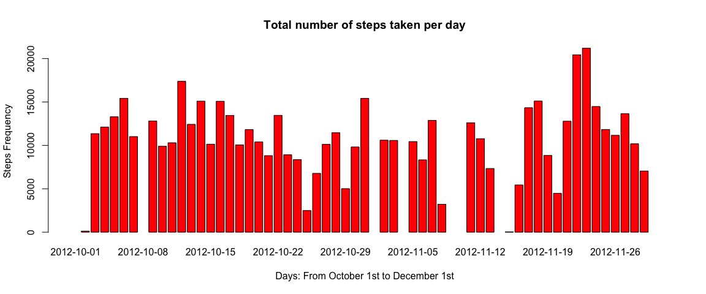
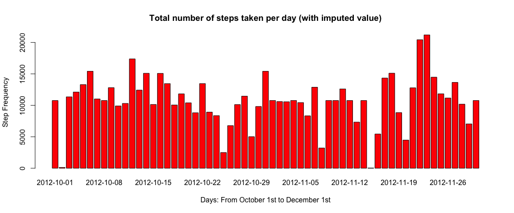

# Reproducible Research: Peer Assessment 1
This is the report produced for the Peer Assignment 1 of "Reproducible Research" in Coursera.

## Loading and preprocessing the data

We load the data and look at the first 5 rows.

```r
setwd("/Users/isa/Documents/Courses/Johns Hopkins/Reproducible Research/Week2/RepData_PeerAssessment1")
data <- read.csv("activity.csv", colClasses = c("numeric", "factor", "numeric"))
head(data)
```

```
##   steps       date interval
## 1    NA 2012-10-01        0
## 2    NA 2012-10-01        5
## 3    NA 2012-10-01       10
## 4    NA 2012-10-01       15
## 5    NA 2012-10-01       20
## 6    NA 2012-10-01       25
```

We transform to a date format the new variable date2 .

```r
library(lubridate)
data$date2=as.Date(strptime(data$date, format="%Y-%m-%d" ),"%Y%m%d")
str(data)
```

```
## 'data.frame':	17568 obs. of  4 variables:
##  $ steps   : num  NA NA NA NA NA NA NA NA NA NA ...
##  $ date    : Factor w/ 61 levels "2012-10-01","2012-10-02",..: 1 1 1 1 1 1 1 1 1 1 ...
##  $ interval: num  0 5 10 15 20 25 30 35 40 45 ...
##  $ date2   : Date, format: "2012-10-01" "2012-10-01" ...
```

```r
summary(data$date2)
```

```
##         Min.      1st Qu.       Median         Mean      3rd Qu. 
## "2012-10-01" "2012-10-16" "2012-10-31" "2012-10-31" "2012-11-15" 
##         Max. 
## "2012-11-30"
```


## What is mean total number of steps taken per day?
First, we aggregate the total number of steps per day and create an histogram that shows the total number of steps per day.

```r
agg <- with(data, aggregate(data$steps, by=list(data$date2), sum))
barplot(agg$x, names.arg = agg$Group.1, col="red", main="Total number of steps per day", xlab="Days",
        ylab="Frequency")
```

 
We calculate the mean and the median:

```r
mean(agg[, "x"], na.rm = TRUE)
```

```
## [1] 10766.19
```

```r
median(agg[, "x"], na.rm = TRUE)
```

```
## [1] 10765
```


## What is the average daily activity pattern?
First, we aggregate the number of steps per intervals and plot the average.


```r
agg2 <- with(data, aggregate(data$steps, by=list(data$interval), mean, na.rm = TRUE))
plot(agg2$Group.1, agg2$x, type = "l", xlab = "Intervals", ylab = "Steps Frequency", 
     main="Average daily activity pattern")
```

 


The interval with the highest averaged number of steps is 835. The highest averaged number of steps is 206.17 as shown in the graf above.

## Imputing missing values
The total number of "NA" (missing values) is:

```r
sum(is.na(data [,1]))
```

```
## [1] 2304
```
We replace missing values with the 5 minutes interval mean and create a new dataset.

```r
names(agg2)[names(agg2) == 'Group.1'] <- 'interval'
names(agg2)[names(agg2) == 'x'] <- 'newsteps'
data2 <- merge(data, agg2, by = "interval")
data2$steps[is.na(data2$steps)] <- data2$newsteps[is.na(data2$steps)]
##Create a new dataset
newdata <- subset(data2, select = c("steps","interval","date2"))
```
Then, we re-aggregate the total number of steps taken per day and create an histogram that shows it.

```r
agg3 <- with(newdata, aggregate(newdata$steps, by=list(newdata$date2), sum))
barplot(agg3$x, names.arg = agg3$Group.1, col="red", main="Total number of steps per day (with imputed value)", xlab="Days",ylab="Frequency")
```

 
We calculate the mean and the median:

```r
mean(agg3[, "x"], na.rm = F)
```

```
## [1] 10766.19
```

```r
median(agg3[, "x"], na.rm = F)
```

```
## [1] 10766.19
```
Conclusion: The effect of replacing missing with "5 min. interval" mean has no impact on the mean but has a very low effect on the median.

## Are there differences in activity patterns between weekdays and weekends?
